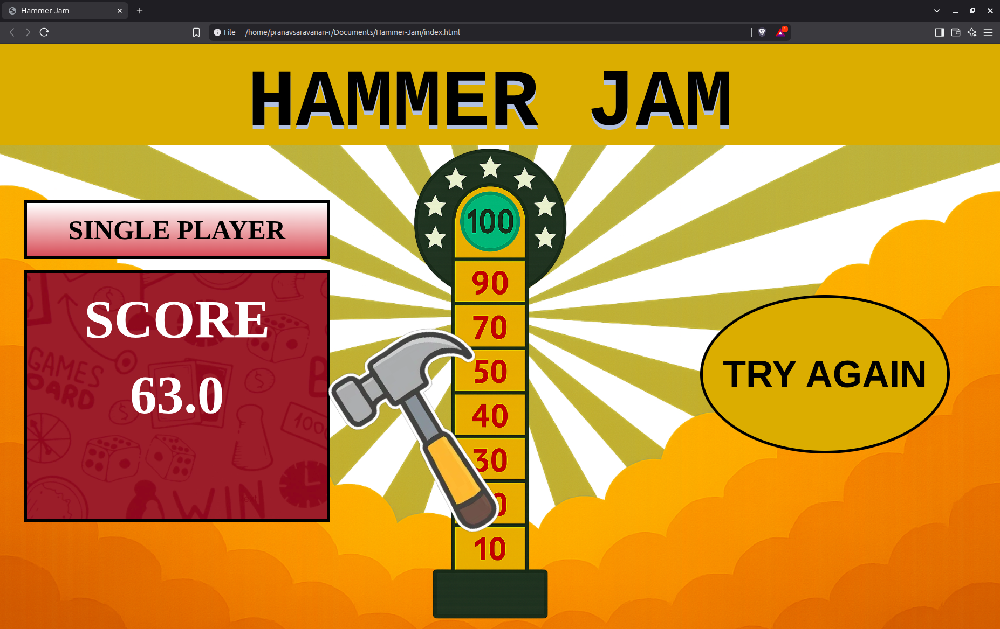

# Basic Tasks for Spider Club of NITT
# Basic Task 1 : Machine Learning
## Vehicle Image Classification System

A deep learning-based image classification system designed to classify various types of vehicles using the [Vehicle Classification Dataset](https://www.kaggle.com/datasets/mohamedmaher5/vehicle-classification) from Kaggle. The model identifies seven distinct classes of vehicles, each with 800 labeled images.

### Dataset Overview

- **Source**: [Kaggle - Vehicle Classification](https://www.kaggle.com/datasets/mohamedmaher5/vehicle-classification)
- **Total Images**: 5,600
- **Classes (7 total)**:
    - Auto Rickshaws
    - Bikes
    - Cars
    - Motorcycles
    - Planes
    - Ships
    - Trains

- **Format**: JPEG (as .jpg)

### Model & Approach

- **Framework**: PyTorch
- **Architecture**: Transfer Learning - ResNet18
- **Input Size**: Resized to 128x128
- **Loss Function**: CrossEntropyLoss
- **Optimizer**: SGD
- **Evaluation Metrics**: Accuracy : 98.25%, F1 Score : 0.9828

# Basic Task 2 : Application Development
## Hammer Jam

An interactive fairground-style "Hammer Strength Test" game where players test their precision and timing.

### Core Features

* A needle swings continuously between 0° and 180°.

* Players click a button or press a key to stop the swing.

* The closer the stop angle is to 90°, the higher the score.

* A perfect stop at 90° awards the maximum score of 100.

* Score decreases linearly or exponentially as the stopped angle deviates from 90°.

* Uses provided images for the strength meter background and hammer.

* Basic UI integrating visuals and displaying the final score clearly.

### Bonus Features

* Variable swing speed with realistic motion: faster near 90°, slower near edges.
* Two Player Mode : Alternate turns, compare scores and declare the winner.

# Basic Task 3 : Blockchain
## Polynomic Vault — Shamir's Secret Sharing Scheme

Polynomic Vault is a Python implementation of **Shamir’s Secret Sharing Scheme (SSS)** — a cryptographic algorithm that splits a secret (like a private key) into multiple shares. Only a threshold number of those shares are required to reconstruct the original secret.

This is widely used for secure multi-party custody of sensitive information, such as blockchain private keys, passwords, or critical credentials.

---

### How It Works

- A secret is encoded as the constant term of a random polynomial.
- `n` shares are created by evaluating the polynomial at `n` distinct x-values.
- Only `k` out of `n` shares are needed to reconstruct the secret using **Lagrange Interpolation** over a finite field.

---

### Features

- Create secret shares with configurable threshold `k` and total shares `n`
- Reconstruct the secret using any `k` valid shares
- Operates over a large prime field (modular arithmetic)

---

### Requirements

- Python 3.x

No external libraries are required.

---

# Machine Learning Domain Specific Tasks
# Task 1-B
## Content-Based Movie Recommender System (TMDB 5000 Dataset)

### Project Overview
This project builds a content-based recommendation system using the TMDB 5000 movie dataset. It recommends movies similar to a user-input title based on movie metadata such as genres, keywords, cast, director, and overview.

---

### 1. Data Preprocessing and Feature Extraction

- Parsed relevant metadata fields: genres, keywords, top 3 cast members, director, and movie overview.
- Cleaned data by handling missing or empty fields.
- Tokenized and normalized text using lowercasing and stemming.
- Combined features into a single textual "tag" representing movie content.
- Applied TF-IDF vectorization to convert text tags into numerical vectors.
- Used feature weighting to emphasize more important metadata (e.g., cast, genres).

---

### 2. Recommendation System Implementation

- Created a custom Dataset class to load and preprocess movie data efficiently.
- Computed cosine similarity between movie vectors to measure content similarity.
- Implemented a function to retrieve top-N recommendations for any given movie title.
- Accounted for edge cases like missing titles or duplicates.

---

### 3. Similarity Function Performance

- Chose cosine similarity for its effectiveness with sparse TF-IDF vectors.
- Tested different preprocessing approaches (stemming vs lemmatization) to optimize recommendations.
- Adjusted feature weights and inclusion of overview text based on qualitative evaluation of results.
- Achieved relevant recommendations with coherent genre and theme alignment.

---

### 4. Code Readability and Documentation

- Modular code structure with clear separation of preprocessing, vectorization, and recommendation logic.
- Meaningful variable names and inline comments for clarity.
- Documented design decisions, preprocessing choices, and trade-offs.
- Demonstrated strong understanding of content-based filtering principles.

---

### Usage Instructions

1. Load and preprocess the dataset using the custom Dataset class.
2. Vectorize combined tags with TF-IDF.
3. Compute cosine similarity matrix.
4. Input a movie title to get top 10 recommended movies based on content similarity.

---

### 📁 Dataset
TMDB 5000 Movie Dataset https://www.kaggle.com/datasets/tmdb/tmdb-movie-metadata

## Task 1-C
### ClassiVision: Classical Computer Vision for Object Detection & Background Removal

ClassiVision applies traditional computer vision techniques to:

1. **Object Detection:**  
   Detect and mark major objects in images using classical methods like contour detection and thresholding, avoiding irrelevant details.

2. **Image Segmentation & Background Removal:**  
   Create clean masks of detected objects and replace backgrounds with solid colors (black or white) to isolate the main subjects.

3. **Real-Time Background Removal:**  
   Use webcam feed to perform real-time background removal or replacement with classical CV algorithms — no machine learning involved.

---

All done using OpenCV and standard image processing operations, showcasing effective non-ML vision techniques.
